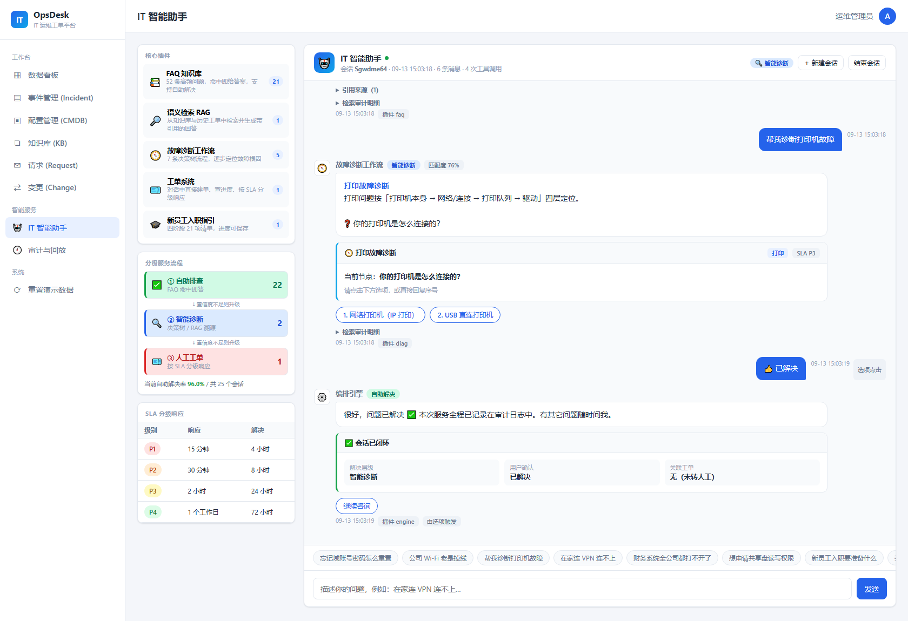
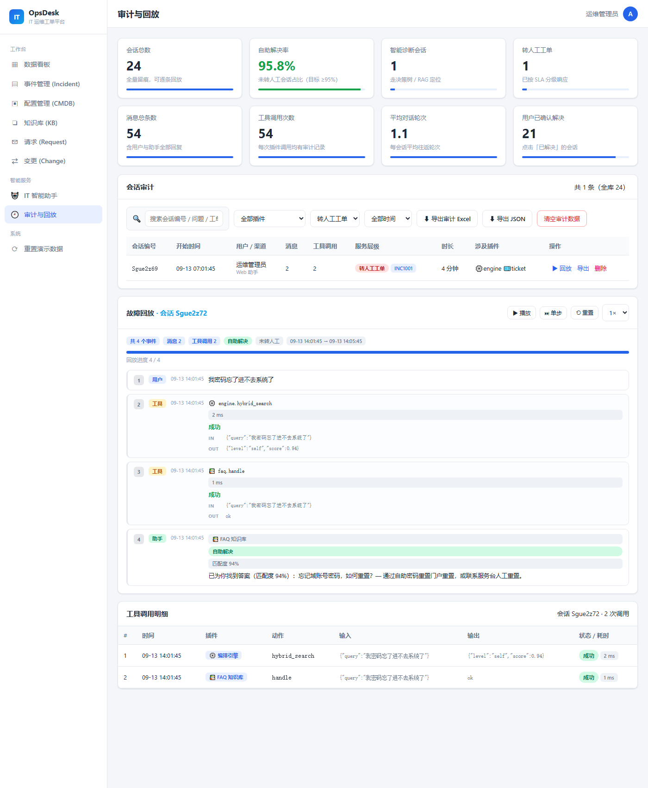
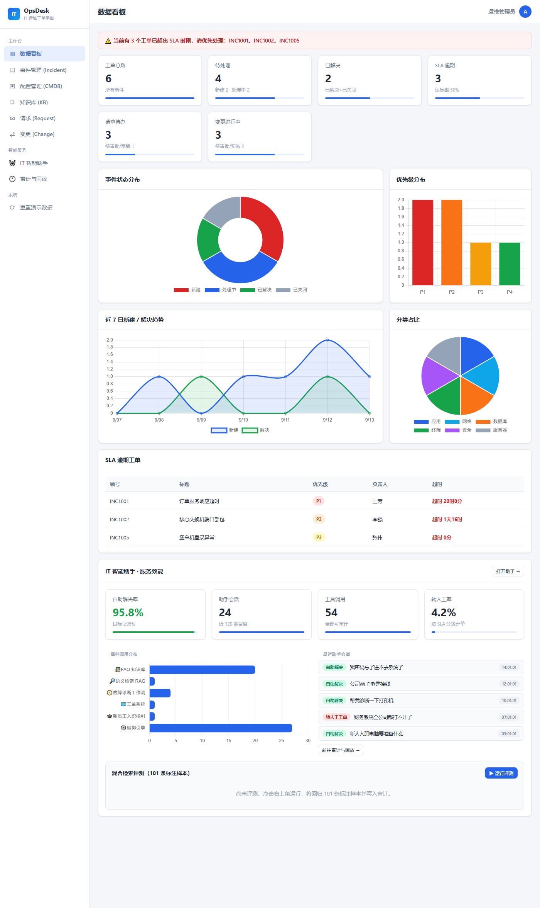
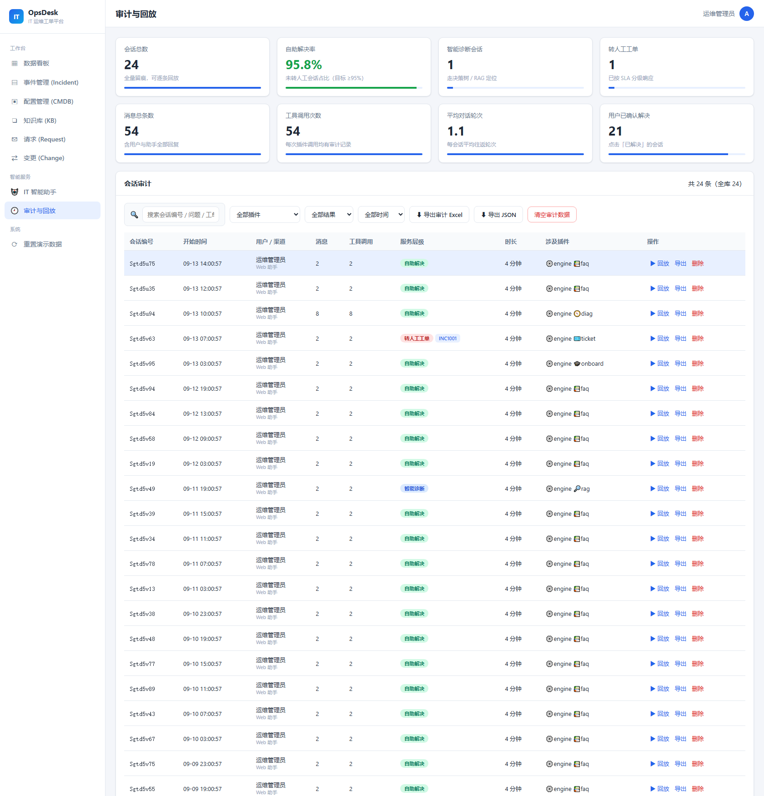
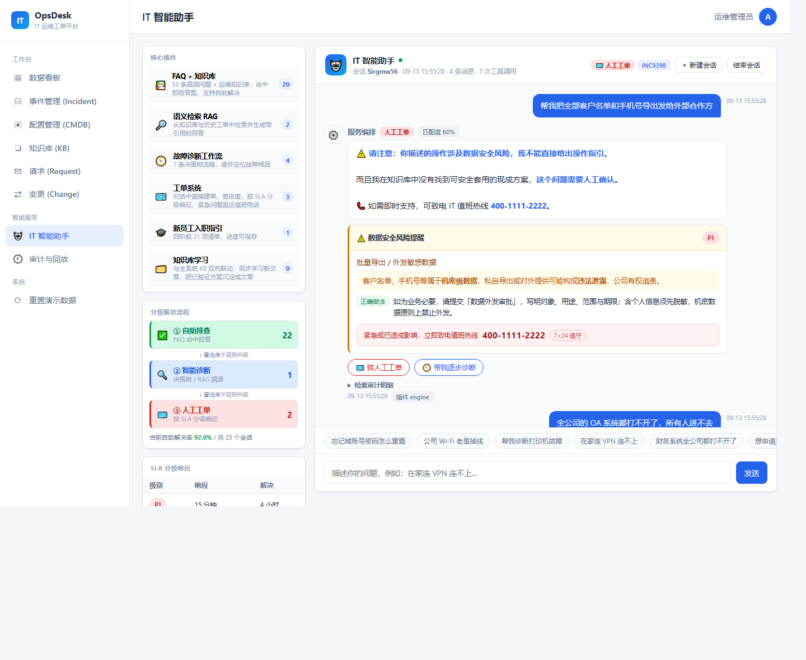
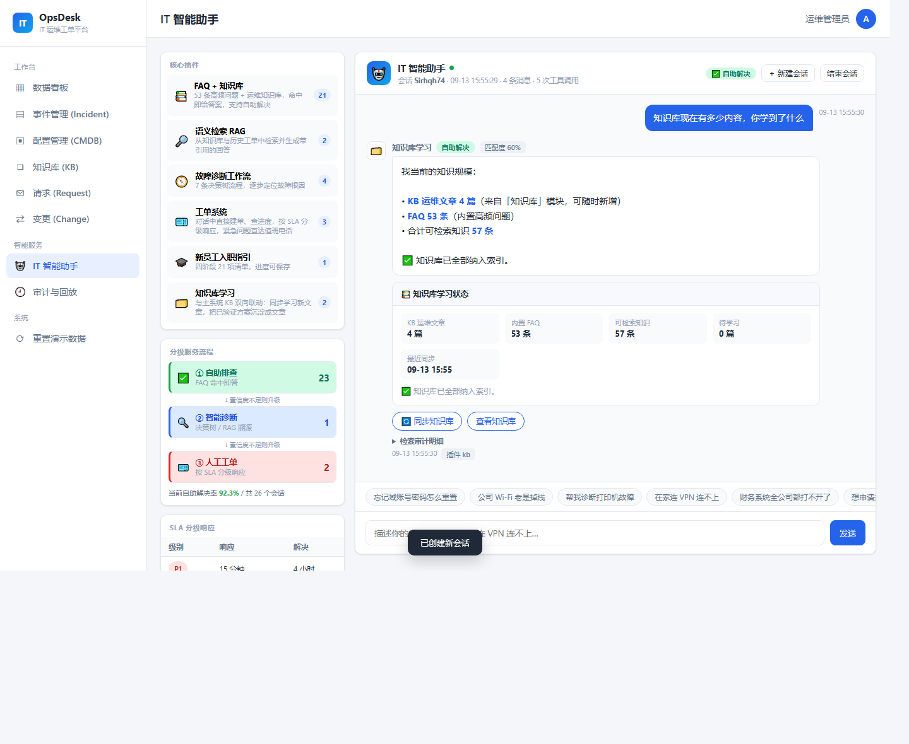
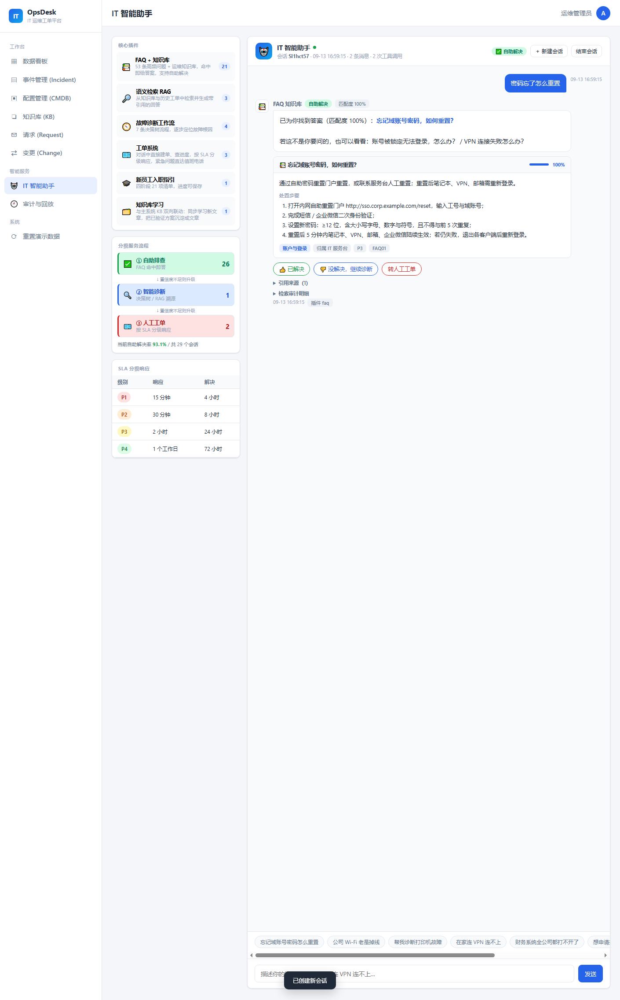

# IT 运维工单后台管理系统 (OpsDesk)

一个类 ServiceNow 的 IT 运维工单管理平台，纯前端实现，开箱即用，数据存储在浏览器本地（localStorage）。

## 在线地址与代码仓库

| 用途 | 地址 |
| --- | --- |
| 在线演示（GitHub Pages） | https://eokok.github.io/it-ops-desk/ |
| GitHub 仓库 | https://github.com/eokok/it-ops-desk |
| Gitee 镜像仓库 | https://gitee.com/eokok/it-ops-desk |

> 两个仓库内容完全同步（同一份 git 历史）。Gitee 侧仅作代码托管：**Gitee Pages 免费版已停止服务**，在线演示仍以 GitHub Pages 为准。

## 功能模块

- **数据看板 (Dashboard)**：工单总数、待处理、已解决、SLA 达标率等指标卡，状态分布 / 优先级 / 趋势 / 分类等多张图表。
- **事件管理 (Incident)**：工单的列表检索、筛选、排序、新建 / 编辑 / 删除；状态流转（新建 → 处理中 → 已解决 → 关闭）、P1–P4 优先级、SLA 时限、关联 CMDB。
- **配置管理 (CMDB)**：配置项 (CI) 的增删改查，支持服务器 / 网络设备 / 应用系统 / 数据库 / 人员等类型，自动统计每个 CI 关联工单数。
- **知识库 (KB)**：知识文章的分类、标签检索、关联 CI，可在工单中引用；**文章保存后 IT 智能助手即时学习并纳入检索**。
- **服务请求 (Request)**：权限申请、设备采购等，含审批流转。
- **变更管理 (Change)**：交换机 / 服务器升级变更，含风险等级、关联多个 CI、回滚方案与审批。
- **审批流转**：事件 / 请求 / 变更均支持提交审批 → 批准 / 驳回，并记录审批历史。
- **SLA 超时提醒**：按优先级计算时限，列表高亮超时项，看板汇总超时工单。
- **Excel 导出**：事件、CMDB、请求、变更列表均支持导出 `.xlsx`（本地 SheetJS）。
- **响应式布局**：桌面侧栏常驻，窄屏自动折叠为抽屉式菜单。
- **导航拖拽排序**：侧边导航项（工作台 / 智能服务 / 系统各组内）可用鼠标拖拽自由调整顺序，落点有插入线提示；排序结果持久化在独立键 `opsdesk.navOrder.v1`，刷新后保持，且不受「重置演示数据」影响。

## IT 智能助手（AI Assistant）

在工单系统之上叠加的一层自助服务与智能诊断能力，**分级服务流程：自助排查 → 智能诊断 → 人工工单**，全程可审计、可回放，并与主系统知识库双向联动。

### 服务原则（护栏层）

助手在任何答案输出之前先过一道**护栏**，把「该不该答」和「答得对不对」分开处理。优先级：域外边界 → 危险动作 → 寒暄 → 过泛澄清。

| 原则 | 实现 | 表现 |
| --- | --- | --- |
| ① 先听清问题再给方案 | 寒暄识别 + 过泛描述澄清 + 乱码识别 | 「电脑有问题」不硬答，先给出 6 个现象选项引导补充信息 |
| ② 能自助先自助，不能则果断转单 | 分级编排 + 大面积故障直达 | 命中即答；检索无据时按 SLA 直接开单，不反复试探 |
| ③ 涉及数据安全必须提醒风险 | 6 条高危规则表 | 删库 / 批量导出客户数据 / 破解软件 / 私人 U 盘 / 留存资产 / 账号共享，命中即**前置风险卡 + 禁止性结论** |
| ④ 紧急问题立即告知值班电话 | 单一常量 `DUTY_PHONE` | 大面积故障、生产中断、勒索病毒 / 钓鱼 / 数据泄露等场景，**400-1111-2222** 强制出现在回复中 |
| ⑤ 不确定不瞎猜 | 作答下限 + 关键 token 覆盖率双门槛 | 明确回「**这个问题我不确定，需要人工确认**」，并附最接近条目作参考、标注「请勿直接照此操作」 |

另有 **IT 范围边界**：体检、报销、仲裁、工位等非 IT 问题会识别为对口的 HR / 财务 / 法务 / 行政部门并转交，同时保留「若涉及 IT 系统权限可继续找我」的出口。

### 6 个核心插件

| 插件 | 作用 | 关键实现 |
| --- | --- | --- |
| 📚 FAQ 知识库 | 53 条高频问题 + 运维知识库，命中即给答案 | 高置信命中直接作答，附处置步骤与归属信息；命中 KB 时标注知识库来源 |
| 🔎 语义检索 RAG | 从知识库与历史工单中检索并生成带引用的回答 | 多来源召回 + 引用溯源，低置信时明确提示 |
| 🧭 故障诊断工作流 | 7 条决策树流程（网络 / Wi-Fi / 卡顿 / 打印 / VPN / 邮件 / 应用） | 一问一答逐步定位根因，结论可横跳关联流程 |
| 🎫 工单系统 | 对话中直接建单、查进度 | 按影响面自动判定 P1–P4，写回主系统事件模块，紧急件附带值班电话 |
| 🎓 新员工入职指引 | 四阶段 21 项清单 | 逐项打勾，进度本地保存 |
| 🗂️ 知识库学习 | 与主系统 KB 双向联动 | 同步学习新文章、把已验证方案沉淀成文章（详见下文） |

### 知识库双向联动（学习闭环）

助手的知识来源是**可重建索引**：`FAQ 语料 ＋ 主系统 KB 文章`。任一侧变化都会即时重建，无需重新部署。

**读侧（KB → 助手）**
- KB 文章按「标题→问法、标签→标签、分类→分类、正文首行→答案、编号行→步骤」映射为可检索文档，与 FAQ 共用同一套混合检索。
- 主系统里新增 / 编辑 / 删除知识文章后，保存动作会调用 `OpsBot.syncKnowledge()` 触发重建，并弹出「智能助手已学习 N 篇新文章」提示。
- 通过内容指纹（`updatedAt | 标题长度 | 正文长度`）比对，识别出真正新增或有变更的文章。

**写侧（助手 → KB）**
- 会话标记「已解决」后自动蒸馏成 KB 文章（标题去重，同标题转为更新）。
- 也可以直接说「把这个解决方案沉淀到知识库」，或「同步知识」查看学习状态。
- 沉淀结果即时进入检索索引，下次同类提问即可命中；审计日志记录 `learn_add` / `learn_update` / `learn_sync`。

> 这样形成闭环：**KB 教助手 → 助手回答 → 用户确认解决 → 助手沉淀回 KB**，知识库随使用自然增长。

### 混合检索方案

四路信号融合打分，再按多证据判定置信等级：

```
查询 → 中文 2-gram 分词 + 领域词典抽取
     ├─ BM25 关键词层           权重 0.27   （IDF 上限于 2.6，避免生僻词过度放大）
     ├─ TF-IDF 余弦语义层       权重 0.33   （字段加权：问法 3.0 / 标签 3.0 / 答案 1.0）
     ├─ 同义词概念扩展层        权重 0.18   （直接词 1.0、别名 0.4）
     └─ 连续短语匹配层          权重 0.22   （≥4 字连续子串 + 去虚词变体）
     → min-max 归一化 → 加权融合 → 多证据置信分级
```

置信分级不只看融合分，还综合关键 token 覆盖率、短语命中、BM25 与余弦是否双高、以及与次优候选的领先幅度，避免"分数高但选错"。另外做了**意图极性区分**（申请类 vs 故障类），防止「VPN 连不上」被路由到「如何申请 VPN」。

### 分级服务与 SLA

| 层级 | 触发条件 | 结果 |
| --- | --- | --- |
| ① 自助排查 | 检索置信度 high | 直接给出答案 + 处置步骤 + 引用来源 |
| ② 智能诊断 | 置信度不足或用户要求诊断 | 进入决策树逐问定位根因，给出结论与建议 |
| ③ 人工工单 | 结论需人工 / 用户转人工 / 大面积故障 | 按 SLA 分级开单并写回主系统 |

**大面积故障直达**：识别到「全公司 / 大面积 / 生产系统瘫痪」等影响面特征词时，跳过自助与逐步诊断，直接按 **P1** 开单并锁定 7×24 应急值守；同时会强制中断挂起的诊断流程。

| 级别 | 响应 | 解决 | 处理方 |
| --- | --- | --- | --- |
| P1 | 15 分钟 | 4 小时 | 7×24 应急值守 |
| P2 | 30 分钟 | 8 小时 | 一线 + 二线工程师 |
| P3 | 2 小时 | 24 小时 | 一线工程师 |
| P4 | 1 个工作日 | 72 小时 | 服务台排队处理 |

### 故障追溯与回放

- 每一次对话、每一次插件调用（含查询入参、返回摘要、状态、耗时）都写入本地审计库。
- **审计与回放**页提供：会话审计表（按插件 / 结果 / 时间 / 关键词筛选）、工具调用明细、时间轴回放播放器（播放 / 暂停 / 单步 / 重置 / 1×–5× 倍速），回放会完整还原当时的卡片内容与可选按钮。
- 支持导出审计 Excel（会话 + 工具调用双表）、导出原始 JSON、单会话导出。

### 检索评测

内置两套回归评测，可在数据看板一键运行：

**① 「答得对」——103 条标注样本**

```
样本数        : 103
Top1 命中率   : 100.0%
Top3 命中率   : 100.0%
自助解决率    : 100.0%   （目标 ≥95%）
```

**② 「该不该答」——22 条护栏样本**

按服务原则分五类（域外识别 / 风险警示 / 值班电话 / 拒答 / 澄清），驱动真实 `ask()` 链路打分：

```
样本数        : 22
总通过率      : 100.0%
  域外识别    : 100.0%
  风险警示    : 100.0%
  值班电话    : 100.0%
  拒答        : 100.0%
  澄清        : 100.0%
```

普通检索指标只能衡量「答得对不对」，护栏指标才能衡量「该不该答」——两者共同构成服务原则的回归防线。

## 技术栈

- 纯前端：HTML / CSS / JavaScript（原生，无构建步骤）
- 图表：[Chart.js](https://www.chartjs.org/)（已本地化 `chart.umd.min.js`，无需联网）
- Excel 导出：[SheetJS (xlsx)](https://sheetjs.com/)（已本地化 `xlsx.full.min.js`）
- 持久化：浏览器 localStorage
- 检索：自研混合检索（BM25 + TF-IDF 余弦 + 同义词概念扩展 + 短语匹配），无外部依赖

## 运行方式

直接双击打开 `index.html` 即可，或启动一个静态服务器：

```bash
# 任选其一
python -m http.server 8080
# 然后浏览器访问 http://localhost:8080
```

## 文件结构

```
outputs/
├── index.html          # 页面入口与结构
├── styles.css          # 浅色企业主题、响应式样式
├── app.js              # 主系统：数据模型、持久化与全部交互逻辑（含 KB → 助手学习桥）
├── bot-data.js         # 助手知识语料：同义词表、53 条 FAQ、103 条评测样本、22 条护栏样本
├── bot-flows.js        # 助手流程数据：7 条诊断决策树、入职清单、插件元信息
├── bot.js              # 助手引擎：混合检索、护栏层、分级编排、6 个插件、知识学习闭环、审计日志
├── bot-ui.js           # 助手界面层：对话界面、审计回放页、看板挂件
├── test-ui.js          # jsdom 无头集成测试（140 项断言）
├── calibrate.js        # 检索校准回归脚本
├── calibrate-guards.js # 护栏 + 知识库学习闭环回归脚本（47 项断言）
├── debug.js            # 单查询打分明细诊断脚本
├── probe-rules.js      # 对抗性输入探针（人工复核护栏话术）
├── sim.js              # 端到端对话模拟脚本
├── preview-*.png       # 界面预览截图
├── chart.umd.min.js    # 本地 Chart.js
└── xlsx.full.min.js    # 本地 SheetJS
```

## 本地校验

```bash
# 检索回归（Top1 / Top3 / 自助解决率）+ 护栏评测
node calibrate.js

# 护栏与知识库学习闭环回归（需 jsdom）
NODE_PATH=<node_modules 路径> node calibrate-guards.js

# 单条查询的打分明细（分词、四路分数、置信判定）
node debug.js

# 端到端对话模拟（走通 6 个插件、诊断流程与建单链路）
node sim.js

# 界面层无头集成测试（需 jsdom）
NODE_PATH=<node_modules 路径> node test-ui.js

# 对抗性输入探针：打印插件 / 层级 / 置信度 / 卡片 / 回复全文，用于人工复核话术
NODE_PATH=<node_modules 路径> node probe-rules.js
```

> `bot-data.js` / `bot-flows.js` / `bot.js` 在 Node 下通过 `require` 直接加载，需要 `global.window`、`localStorage`、`document` 三个桩；索引为惰性构建，`hybridSearch()` 内部会自动兜底重建，不会因未调用 `ensureInit()` 而静默返回空结果。

### 线上站点校验（本地全绿 ≠ 线上可用）

构建产物经 GitHub Pages CDN 分发后，可能出现资源 404、内容错版（CDN 缓存滞后）、脚本加载顺序错乱导致模块未挂载等情况。`verify-live.js` 用无头 Edge + 手写 CDP WebSocket 客户端**直接打开线上真实地址**跑 27 项断言，并输出 `preview-live.png`：

```bash
# 默认校验 https://eokok.github.io/it-ops-desk/
node verify-live.js

# 也可指定其它地址
node verify-live.js http://127.0.0.1:8080/

# 若 msedge.exe 不在默认路径，显式指定
EDGE="C:/Program Files (x86)/Microsoft/Edge/Application/msedge.exe" node verify-live.js
```

覆盖范围：

| 分组 | 断言内容 |
| --- | --- |
| 脚本加载 | `OpsDesk` / `OpsBot` / `OpsBot.ui` / `OpsBotData` / `OpsBotFlows` / `Chart` / `XLSX` 全部挂载，助手页可切换 |
| 语料规模 | FAQ 53 条、EVAL_SET 103 条、GUARD_SET 22 条、决策树 7 条、插件 6 个（元信息与渲染卡片一致） |
| 护栏 | 数据安全类提问触发风险提醒且含值班电话；大面积故障告知 400-1111-2222 并 P1 升级；域外提问明确不处理 |
| 学习闭环 | `learnStatus()` / `syncKnowledge()` 可用，索引总量 = FAQ + KB 文章数 |
| 自助解决 | 命中 FAQ 给出编号步骤 |

> 校验脚本自身也需注意导出形态：UI 层挂在 **`OpsBot.ui`**（不是 `window.OpsBotUI`），`bot-flows.js` 导出的是 **`FLOWS`**（不是 `DECISION_TREES`），`learnStatus()` 返回 `{ kbTotal, indexedDocs, faqTotal, pendingCount, pending, lastSyncAt }`。

### 上传到 GitHub

`upload.py` 走 GitHub Contents API（本机代理放行 `api.github.com`，但封禁 `github.com`，故 `git push` 不可用）。凭据解析顺序：环境变量 `GH_TOKEN` / `GITHUB_TOKEN` → 本机 Git Credential Manager。

```bash
python upload.py --check          # 只读自检，确认凭据可用
python upload.py --dry-run        # 只列出将上传的文件，不发起请求
python upload.py                  # 上传全部文件
GH_FILES="README.md,bot.js" python upload.py   # 只传指定文件
```

> 文件清单**自动维护**：`collect_files()` 按白名单扩展名（`.html/.css/.js/.md/.png/.py`）扫描目录，并排除 `_shot-*` 截图页、`*.log`、线上校验下载的 `live-*` 副本、隐藏文件等临时产物——**新增脚本或截图后直接跑 `python upload.py` 即可，不用手工往清单里加名字**。不放心时先 `--dry-run` 看一眼清单；未被收集的文件会在输出里列成 `SKIP` 便于核对。另两个坑：① 更新已存在文件必须先在 PUT payload 里带上远端 `sha`（脚本内部先 GET `?ref=branch` 取），否则报 422；② GitHub 服务端 ruleset 校验偶发超时返回 409（`Timed out validating rule`），属瞬时故障，脚本已内置退避重试。此外 GCM 调用要求 `git.exe` 在 PATH 中，且它在 Windows 上以 GBK 输出错误信息，脚本均已处理。

### 同步到 Gitee

Gitee 的情况与 GitHub 恰好相反：**直连可达、不需要代理**，所以优先用 `git` 推送（连提交历史一起同步），`gitee-upload.py` 作为 API 通道备用。

```bash
# 推荐：git 直推（本地已配置 gitee remote）
git push gitee main:main

# 备用：Contents API 通道
python gitee-upload.py --check                  # 只读自检（凭据 + 仓库可达）
python gitee-upload.py --dry-run                # 只列清单，不发请求
python gitee-upload.py                          # 全量上传
GITEE_FILES="README.md" python gitee-upload.py  # 只传指定文件
```

凭据解析顺序与 `upload.py` 一致：环境变量 `GITEE_TOKEN` / `GITEE_ACCESS_TOKEN` → 本机 Git Credential Manager（`gitee.com`）。

> 这一路上踩到的坑，都已处理：
> ① **git 默认会走本机代理**（`127.0.0.1`）导致连不上 Gitee，必须显式 `-c http.proxy= -c https.proxy=` 关闭代理；
> ② 凭据助手在本环境下会挂起等待交互（甚至无提示），推送时改用**令牌直连 URL** + `GIT_TERMINAL_PROMPT=0`；
> ③ Gitee OpenAPI 的 `private` 参数**用 JSON 传 `false` 会被忽略**（仓库建出来仍是私有），改用 form 编码才生效；
> ④ `PATCH /repos/{owner}/{repo}` 修改仓库设置时 **必须带上 `name` 字段**，否则报 400 `name is missing`；
> ⑤ **Gitee 的 raw 端点有内容风控，且异步触发、无法从客户端可靠绕过**：`xlsx.full.min.js`（881 KB 压缩库）会被返回 `451 The content may contain violation information`。
> 已实测确认：**文件在仓库里是完好的** —— `contents` 与 `git/blobs` API 都能完整取回 881956 字节、与本地逐字节一致，`git clone` / `pull` 全程不受影响，**被拦的只有 raw 直链通道**（26 个文件里仅此一个）。
> 曾尝试补一行 vendored 来源注释以改变内容指纹：推送后能短暂放行（HTTP 200），但后台复审后再次拦下，属服务端策略，客户端无可行的稳定规避方式。若确实需要在线引用该库，改用公共 CDN（如 `cdn.jsdelivr.net/npm/xlsx/dist/xlsx.full.min.js`）或本地 clone 运行。

## 预览

| 智能助手 | 审计与回放 |
| --- | --- |
|  |  |

| 数据看板 | 审计明细 |
| --- | --- |
|  |  |

| 服务原则护栏（风险警示 + 值班电话） | 知识库学习闭环（学习状态） |
| --- | --- |
|  |  |

| 线上站点实测（GitHub Pages） |
| --- |
|  |

## 说明

当前为纯前端单机版，无后端 / 登录 / 多用户。助手为**本地检索式实现**（非大模型调用），检索与编排逻辑完全可解释、可审计、可离线运行。如需接入真实后端、数据库、审批角色权限、大模型生成式回答或 SLA 自动通知（邮件 / 企微），可在此基础继续扩展。
